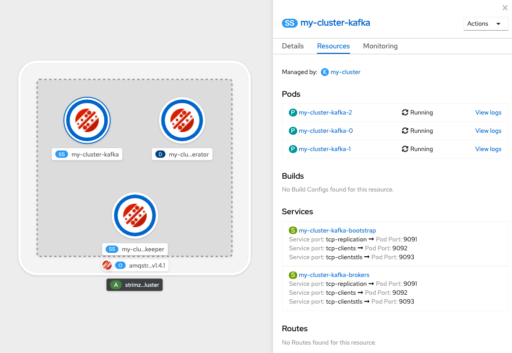

# Install  OpenShift Serverless, OpenShift Pipelines, Client Tools and AMQ Streams

This tutorial has been tested with the following version.
```
OCP 4.4.3
OpenShift Serverless Operator 1.7.0
OpenShift Pipelines Operator  0.11.2
kn client v0.13.2
tkn client v0.9.0
```
**Note:** OpenShift Pipelines is still Community and Knative Eventing is still in tech preview.

## Install Knative Serving, Knative Eventing 
Install OpenShift Serverless Operator as explained [here](https://docs.openshift.com/container-platform/4.4/serverless/installing_serverless/installing-openshift-serverless.html)
* Install Knative Serving as explained [here](https://docs.openshift.com/container-platform/4.4/serverless/installing_serverless/installing-knative-serving.html)
* Install Knative Eventing as explained [here](https://docs.openshift.com/container-platform/4.4/serverless/installing_serverless/installing-knative-eventing.html)

## Install OpenShift Pipelines
* Select OpenShift Pipelines Operator provided by Red Hat, Community and install the operator

## Install CLI tools
* On the right top corner of your openshift console, click on `?` , navigate to `Command Line Tools` and download CLIs for `oc`, `kn` and `tkn`


* Add the CLI to your PATH

## Latest Developer Console (OPTIONAL)

These labs use latest nightly build of Developer Console. If you are interested in running these labs using GUI where possible, you may want to install latest developer console using the approach below

* [Install the latest Dev Console as another application](https://github.com/VeerMuchandi/ocp4-extras/tree/master/devconsole)

## Install Knative Kafka Operator

You will need this only if you are trying [eventing use cases with Kafka](./README.md#kafka). Otherwise you can skip this section.

* Find `Knative Apache Kafka Operator` by Red Hat in the Operator Hub, and install the same
* In the `knative-eventing` namespace, create an Custom Resource for `Knative components for Apache Kafka` with the spec
  ```
  spec:
  bootstrapServers: 'my-cluster-kafka-bootstrap.kafka:9092'
  setAsDefaultChannelProvisioner: true
  ```
*Note* this is a default spec that configures bootstrap expecting a kafka cluster named `my-cluster` in the namespace `kafka`

* This CR adds following pods to `knative-eventing` namespace 
```
kafka-ch-controller-f9589648f-hqz6c         1/1     Running   0          7d4h
kafka-ch-dispatcher-64976f876b-6xh49        1/1     Running   7          6d8h
kafka-controller-manager-6fb468f444-5lmvt   1/1     Running   0          7d4h
kafka-webhook-66875c495-cb5s8               1/1     Running   0          7d4h
```


## Install AMQ Streams

You will need this only if you are trying [eventing use cases with Kafka](./README.md#kafka). Otherwise you can skip this section.

* Find `Red Hat Integration - AMQ Streams` by Red Hat in the Operator Hub and install this cluster wide operator.
* Create a new project named `kafka`
* Create a new kafka cluster by instantiating `Kafka` custom resource in the `kafka` project
 You can choose the default specification for kafka cluster which creates a kafka cluster named `my-cluster` with 3 replicas.

 ```
 apiVersion: kafka.strimzi.io/v1beta1
kind: Kafka
metadata:
  name: my-cluster
  namespace: kafka
spec:
  kafka:
    version: 2.4.0
    replicas: 3
    listeners:
      plain: {}
      tls: {}
    config:
      offsets.topic.replication.factor: 3
      transaction.state.log.replication.factor: 3
      transaction.state.log.min.isr: 2
      log.message.format.version: '2.4'
    storage:
      type: ephemeral
  zookeeper:
    replicas: 3
    storage:
      type: ephemeral
  entityOperator:
    topicOperator: {}
    userOperator: {}
 ```

*Note* In the previous step we installed Kafka Knative Serving that expects a kafka cluster in `kafka` namespace with a name `my-cluster`

* In a few minutes you will see a `my-cluster` running with the following pods

```
% oc get po -n kafka      
NAME                                         READY   STATUS    RESTARTS   AGE
my-cluster-entity-operator-f796fb9c4-djssr   3/3     Running   0          7d4h
my-cluster-kafka-0                           2/2     Running   1          7d4h
my-cluster-kafka-1                           2/2     Running   0          7d4h
my-cluster-kafka-2                           2/2     Running   0          7d4h
my-cluster-zookeeper-0                       2/2     Running   0          7d5h
my-cluster-zookeeper-1                       2/2     Running   0          7d5h
my-cluster-zookeeper-2                       2/2     Running   0          7d5h
```


Here is how the kafka cluster shows up on developer console when you navigate to `kafka` namespace




<a name="installsqscontroller"></a>
## Install AWS SQS Controller

You will need this only if you are trying eventing use cases with AWS Simple Queue Service (SQS). Otherwise you can skip this section. 

The steps described here help a cluster administrator set up AWS SQS Controller on your cluster.

* Currently, installing AWS SQS controller requires [ko client](https://medium.com/knative/ko-fast-kubernetes-microservice-development-in-go-f94a934a7240). Note this has dependencies on golang, docker client and access to a public repository where the AWS SQS Controller images will be built and pushed to.

* We will be building AWS SQS controller from source code. So git clone the source code from the [eventing-contrib github](https://github.com/knative/eventing-contrib/tree/master/awssqs) repository. Once cloned move to `eventing-contrib/awssqs` folder.

* Run the following command (as a cluster administrator), to build and deploy AWS SQS Controller on your cluster

```
export KO_DOCKER_REPO=<yourAuthenticatedContainerRegistry>
ko apply -f config/
```

and note the output as follows

```
2020/06/24 10:51:41 NOTICE!
-----------------------------------------------------------------
We are changing the default base image in a subsequent release.

For more information (including how to suppress this message):

   https://github.com/google/ko/issues/160

-----------------------------------------------------------------
2020/06/24 10:51:42 Using base gcr.io/distroless/static:latest for knative.dev/eventing-contrib/awssqs/cmd/receive_adapter
2020/06/24 10:51:42 Using base gcr.io/distroless/static:latest for knative.dev/eventing-contrib/awssqs/cmd/controller
namespace/knative-sources created
serviceaccount/awssqs-controller-manager created
2020/06/24 10:51:43 Building knative.dev/eventing-contrib/awssqs/cmd/receive_adapter
2020/06/24 10:51:43 Building knative.dev/eventing-contrib/awssqs/cmd/controller
clusterrole.rbac.authorization.k8s.io/awssqs-controller created
clusterrole.rbac.authorization.k8s.io/eventing-contrib-awssqs-source-observer created
clusterrolebinding.rbac.authorization.k8s.io/awssqs-controller-rolebinding created
clusterrolebinding.rbac.authorization.k8s.io/eventing-sources-awssqs-controller-addressable-resolver created
customresourcedefinition.apiextensions.k8s.io/awssqssources.sources.knative.dev created
2020/06/24 10:51:46 Publishing quay.io/veermuchandi/receive_adapter-60659434536f4a21c0a85abbf570544a:latest
2020/06/24 10:51:49 Publishing quay.io/veermuchandi/controller-312a0ccf75926fd0a58b0187285bc0ce:latest
2020/06/24 10:52:28 Published quay.io/veermuchandi/receive_adapter-60659434536f4a21c0a85abbf570544a@sha256:79bb4ac4b9ed42af98599f70b690ebacbf5b0fff75485a9c371a7e782dd8b977
2020/06/24 10:52:48 Published quay.io/veermuchandi/controller-312a0ccf75926fd0a58b0187285bc0ce@sha256:817e073ff12fecf9d05660226fcb61ddbb1e7e09e5f8f0cc61c14fce2735b378
deployment.apps/awssqs-controller created
serviceentry.networking.istio.io/awssqs-bus-ext created
configmap/config-leader-election-awssqs created
configmap/config-logging created
configmap/config-observability created
```
 This will create a new namespace `knative-sources` on your cluster and deploys the controller into that namespace. It also adds roles, service accounts and configmaps required for your deployment.

In a few minutes, you can find `awssqs-controller` running in this namespace.

```
$ oc get po -n knative-sources 
NAME                                 READY   STATUS    RESTARTS   AGE
awssqs-controller-794667495c-p4jd5   1/1     Running   0          4h29m
```