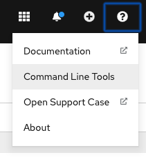

# Install  OpenShift Serverless, OpenShift Pipelines and  Client Tools

This tutorial has been tested with the following version.
```
OCP 4.4.3
OpenShift Serverless Operator 1.7.0
OpenShift Pipelines Operator  0.11.2
kn client v0.13.2
tkn client v0.9.0
```
**Note:** OpenShift Pipelines is still Community and Knative Eventing is still in tech preview.

## Install Knative Serving, Knative Eventing 
Install OpenShift Serverless Operator as explained (here)[https://docs.openshift.com/container-platform/4.4/serverless/installing_serverless/installing-openshift-serverless.html]
* Install Knative Serving as explained (here)[https://docs.openshift.com/container-platform/4.4/serverless/installing_serverless/installing-knative-serving.html]
* Install Knative Eventing as explained (here)[https://docs.openshift.com/container-platform/4.4/serverless/installing_serverless/installing-knative-eventing.html]

## Install OpenShift Pipelines
* Select OpenShift Pipelines Operator provided by Red Hat, Community and install the operator

## Install CLI tools
* On the right top corner of your openshift console, click on `?` , navigate to `Command Line Tools` and download CLIs for `oc`, `kn` and `tkn`



* Add the CLI to your PATH

