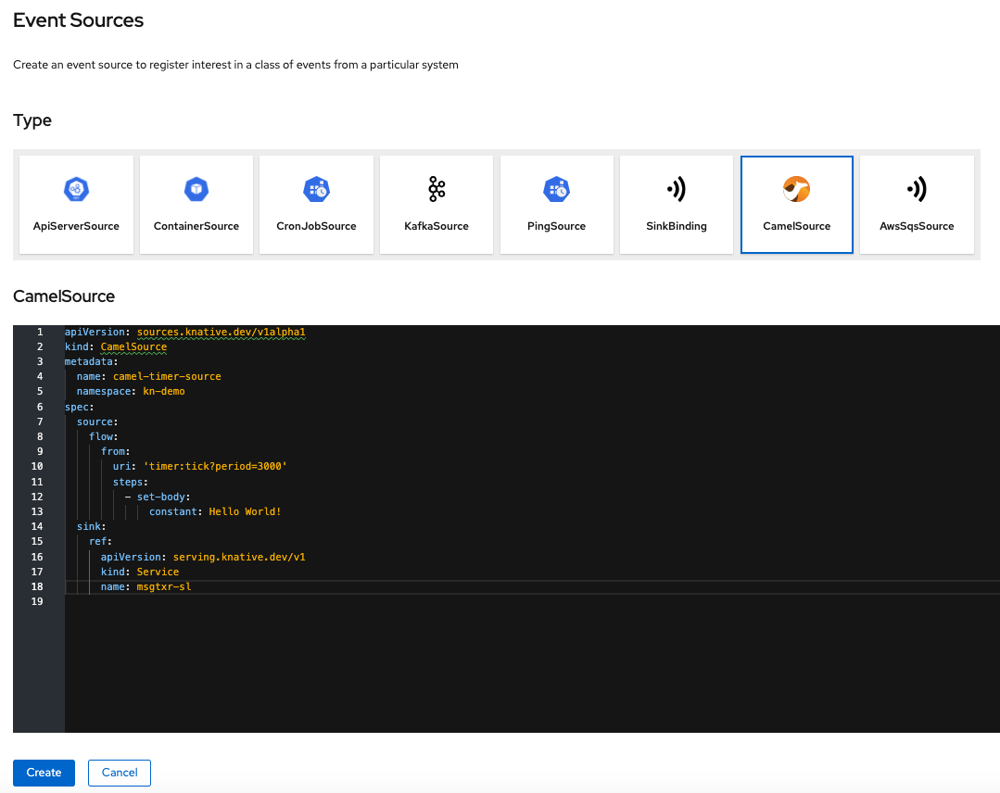
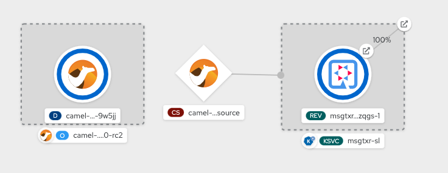

# Adding Camel Source as Direct Source to your Application

## Prerequisites
* Cluster administrator should [install Knative Apache Camel](./1.InstallKnativeAndTekton.md#installknativeapachecamel) on your cluster
* You have a Knative service deployed. Add a knative service running `kn service create msgtxr-sl --image=image-registry.openshift-image-registry.svc:5000/kn-demo/msgtxr -l app.openshift.io/runtime=quarkus --env format=none`


## Add AWS SQS Source

We will now create a camel source that generates messages and sinks those messages to your knative service. 

Navigate to `Add` menu option, choose `Event Sources` tile and then Camel Source. 

Paste the following yaml to create a camel source that sinks to knative service.

```
apiVersion: sources.knative.dev/v1alpha1
kind: CamelSource
metadata:
  name: camel-timer-source
  namespace: kn-demo 
spec:
  source:
    flow:
      from:
        uri: 'timer:tick?period=3000'
        steps:
          - set-body:
              constant: Hello World!
  sink:
    ref:
      apiVersion: serving.knative.dev/v1
      kind: Service
      name: msgtxr-sl
```
as shown below



Alternately, you can also create this running 
`oc apply -f camelk/camel-source.yaml`

This will build and deploy a camelk timer source that periodically sends messages to the knative service. It will show up on your developer console as below:




## Verify

Check the logs for the knative service to find the messages being posted 

```
__  ____  __  _____   ___  __ ____  ______ 
 --/ __ \/ / / / _ | / _ \/ //_/ / / / __/ 
 -/ /_/ / /_/ / __ |/ , _/ ,< / /_/ /\ \   
--\___\_\____/_/ |_/_/|_/_/|_|\____/___/   
2020-07-06 20:41:23,372 INFO  [io.quarkus] (main) getting-started 1.0-SNAPSHOT (powered by Quarkus 1.3.2.Final) started in 0.012s. Listening on: http://0.0.0.0:8080
2020-07-06 20:41:23,372 INFO  [io.quarkus] (main) Profile prod activated. 
2020-07-06 20:41:23,372 INFO  [io.quarkus] (main) Installed features: [cdi, resteasy]
20:41:23.764 IN Hello World! OUT Hello World!
20:41:23.764 IN Hello World! OUT Hello World!
20:41:26.488 IN Hello World! OUT Hello World!
20:41:47.613 IN Hello World! OUT Hello World!
20:41:50.376 IN Hello World! OUT Hello World!
20:41:53.371 IN Hello World! OUT Hello World!
```


## Conclusion

In this chapter we have learnt to configure CamelK source as a direct source for your knative service


## Cleanup

Delete Camel K Source

```
oc delete -f camelk/camel-source.yaml
```
