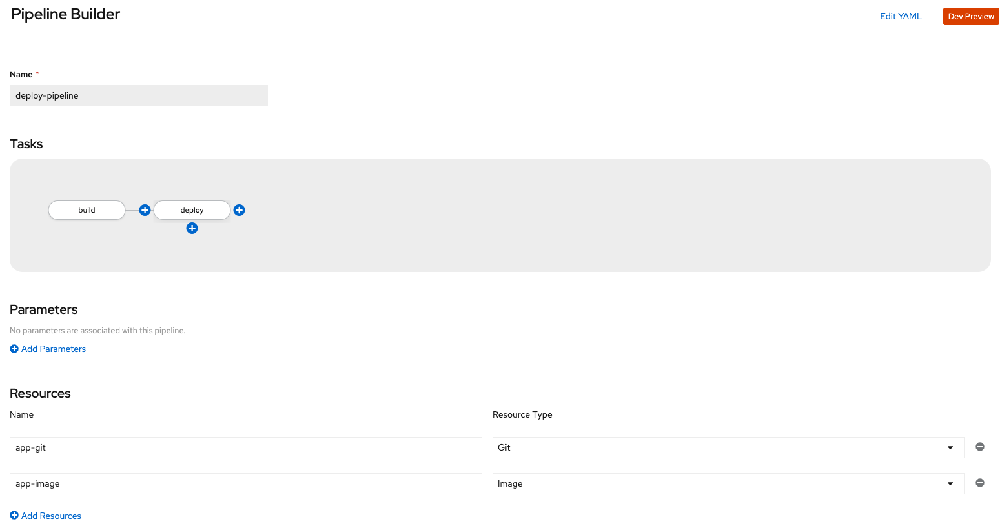

# Build using OpenShift Pipeline


## Pre-requisites
* OCP4 cluster with OpenShift Pipelines installed
* `git clone` this repository. We have some samples here.
* * Clone the project from https://github.com/RedHatWorkshops/knative-on-ocp4
* * `cd knative-on-ocp4`

## Steps

### Set up a new project and create application objects

Create a new project 

```
oc new-project kn-demo
```

We will build and deploy application from this (github repository)[https://github.com/VeerMuchandi/mesgtxformer]. This application is written in Quarkus, Kubernetes-native Java.

We will first create the application objects `imagestream`, `deploymentconfig`, `service` and `route`. 

```
$ oc create -f https://raw.githubusercontent.com/VeerMuchandi/mesgtxformer/master/openshift-objects.yaml


imagestream.image.openshift.io/msgtxr created
deploymentconfig.apps.openshift.io/msgtxr created
service/msgtxr created
route.route.openshift.io/msgtxr created
```

### Set up a Tekton Pipeline

Your OpenShift cluster should a bunch of tekton tasks configured as cluster tasks which you can list by running:

`tkn clustertask list`

**Note:** List of S2I build tasks available for different languages can be found here:
[https://github.com/openshift/pipelines-catalog](https://github.com/openshift/pipelines-catalog)

However, we currently don't have a cluster task to build a Quarkus application. We will use Openshift S2I to run a native build. So let us create a custom task in our namespace. Feel free to review the task at (https://raw.githubusercontent.com/RedHatWorkshops/knative-on-ocp4/master/pipeline/s2i-quarkus-native.yaml)[https://raw.githubusercontent.com/RedHatWorkshops/knative-on-ocp4/master/pipeline/s2i-quarkus-native.yaml]

```
$ oc create -f https://raw.githubusercontent.com/RedHatWorkshops/knative-on-ocp4/master/pipeline/s2i-quarkus-native.yaml

task.tekton.dev/s2i-quarkus-native created
```
Now list the tasks in the project and you will see the task that we just added.

```
$ tkn tasks list
NAME                 DESCRIPTION   AGE
s2i-quarkus-native                 16 minutes ago
```

Now it is time to create a pipeline. You can either create it from command line or from openshift devconsole. 

Pipeline menu option in devconsole allows you to interactively create or edit a pipeline. You are encouraged to try that option as it is intuitive. In this guide, the rest of the steps will show the CLI approach.




Let us look at the pipeline that shows the list of tasks within the pipeline to create the application image using `s2i-quarkus-native` task and deploy it using `openshift-client` task. Note that this pipeline depends on source code coming from `app-git` and pushes image to `app-image` resource.

```
apiVersion: tekton.dev/v1alpha1
kind: Pipeline
metadata:
  name: deploy-pipeline
spec:
  resources:
  - name: app-git
    type: git
  - name: app-image
    type: image
  tasks:
  - name: build
    taskRef:
      kind: Task
      name: s2i-quarkus-native
    params:
      - name: TLSVERIFY
        value: "false"
    resources:
      inputs:
      - name: source
        resource: app-git
      outputs:
      - name: image
        resource: app-image
  - name: deploy
    taskRef:
      kind: ClusterTask
      name: openshift-client
    runAfter:
      - build
    params:
    - name: ARGS
      value: 
           - rollout
           - latest
           - msgtxr
```

Let us create the pipeline by running

```
$ oc create -f https://raw.githubusercontent.com/RedHatWorkshops/knative-on-ocp4/master/pipeline/pipeline.yaml

pipeline.tekton.dev/deploy-pipeline created
```

The resources used by this pipeline are defined in the `pipeline-resources` file as shown below:

```
apiVersion: tekton.dev/v1alpha1
kind: PipelineResource
metadata:
  name: application-image
spec:
  type: image
  params:
  - name: url
    value: image-registry.openshift-image-registry.svc:5000/kn-demo/msgtxr
---
apiVersion: tekton.dev/v1alpha1
kind: PipelineResource
metadata:
  name: sourcecode-git
spec:
  type: git
  params:
  - name: url
    value: https://github.com/VeerMuchandi/mesgtxformer

```

Now let us add these pipeline-resources running:

```
$ oc create -f https://raw.githubusercontent.com/RedHatWorkshops/knative-on-ocp4/master/pipeline/pipeline-resources.yaml

pipelineresource.tekton.dev/application-image created
pipelineresource.tekton.dev/sourcecode-git created
```

Let us use `tkn` to verify all the objects we just created as shown below:

```
$ tkn pipeline list
NAME              AGE           LAST RUN   STARTED   DURATION   STATUS
deploy-pipeline   2 hours ago   ---        ---       ---        ---

$ tkn resource list
NAME                TYPE    DETAILS
sourcecode-git      git     url: https://github.com/VeerMuchandi/mesgtxformer
application-image   image   url: image-registry.openshift-image-registry.svc:5000/kn-demo/msgtxr

```

Now let us run the pipeline using `tkn`. This pipeline can also be started from devconsole.
* `-s` option is to pass the Service Account used to run this pipeline.
* `-r` option is used to pass the values for resources. Our pipeline above uses 2 resources and their values are already defined in the pipeline resources. So we are just passing those pipeline resources inputs while running the pipeline

`tkn pipeline start` will create a new `pipelinerun` object to start the pipeline.

```
$ tkn pipeline start deploy-pipeline -s pipeline -r app-git=sourcecode-git -r app-image=application-image

Pipelinerun started: deploy-pipeline-run-pkth8

In order to track the pipelinerun progress run:
tkn pipelinerun logs deploy-pipeline-run-pkth8 -f -n kn-demo
```
Note the name of the `pipelinerun` pod created above. We will use this to track the pipeline logs next. Run the following command to watch the logs. The pipeline run will clone the source code, generate a dockerfile, run a build using buildah, push the resultant image and then deploy that container image.

```
$ tkn pipelinerun logs deploy-pipeline-run-pkth8 -f -n kn-demo
```

This will output the logs as below:

```
[build : git-source-sourcecode-git-wcm7n] {"level":"info","ts":1589407307.4596121,"caller":"git/git.go:105","msg":"Successfully cloned https://github.com/VeerMuchandi/mesgtxformer @ master in path /workspace/source"}
[build : git-source-sourcecode-git-wcm7n] {"level":"warn","ts":1589407307.4596806,"caller":"git/git.go:152","msg":"Unexpected error: creating symlink: symlink /tekton/home/.ssh /root/.ssh: file exists"}
[build : git-source-sourcecode-git-wcm7n] {"level":"info","ts":1589407307.5098634,"caller":"git/git.go:133","msg":"Successfully initialized and updated submodules in path /workspace/source"}

[build : generate] Application dockerfile generated in /gen-source/Dockerfile.gen

[build : build] STEP 1: FROM quay.io/quarkus/ubi-quarkus-native-s2i:20.0.0-java8
[build : build] Getting image source signatures
[build : build] Copying blob sha256:cf0f3ebe9f536c782ab3835049cfbd9a663761ded9370791ef6ea3965c823aad


...
...

[build : push] Writing manifest to image destination
[build : push] Storing signatures

[build : image-digest-exporter-tkzj7] {"level":"info","ts":1589407598.3208406,"logger":"fallback-logger","caller":"logging/config.go:76","msg":"Fetch GitHub commit ID from kodata failed: \"KO_DATA_PATH\" does not exist or is empty"}
[build : image-digest-exporter-tkzj7] {"level":"info","ts":1589407598.3209352,"logger":"fallback-logger","caller":"imagedigestexporter/main.go:59","msg":"No index.json found for: application-image"}

[deploy : oc] + oc rollout latest msgtxr
[deploy : oc] I0513 22:06:52.626401      13 request.go:621] Throttling request took 1.156705194s, request: GET:https://172.30.0.1:443/apis/cloudcredential.openshift.io/v1?timeout=32s
[deploy : oc] deploymentconfig.apps.openshift.io/msgtxr rolled out

```

You can also observe the running pipeline on devconsole. Navigate to your project `kn-demo` -> `Pipelines` from menu ->  select the pipelinerun that is currently in progress

Notes: you will need developer console to do the following steps.

You will see a screen like this:


You will observe that the deployment is also successful. You can look at the topology view of the running app.


Click on the link url on the right to corner of the dumpy icon or  run `oc get route` to find your application route to bring the running application up in the browser.

You will see output like this :

```
MESSAGE TITLE CASED : "This Is Default Prod Message"

```

Congratulations!! You have successfully build and deployed application on OCP4.x using openshift pipelines.

##  Closing

We are going to deploy this application with knative-serving in the next lab. Let us idle this application for now.

**Note: ** Scale to zero was in OpenShift for years now. 

```
$ oc idle msgtxr
The service "kn-demo/msgtxr" has been marked as idled 
The service will unidle DeploymentConfig "kn-demo/msgtxr" to 1 replicas once it receives traffic 
DeploymentConfig "kn-demo/msgtxr" has been idled 
```

Note that the app shows without a blue circle on the screen showing that the pod is not running. But if you try to access it, it will scale up.


