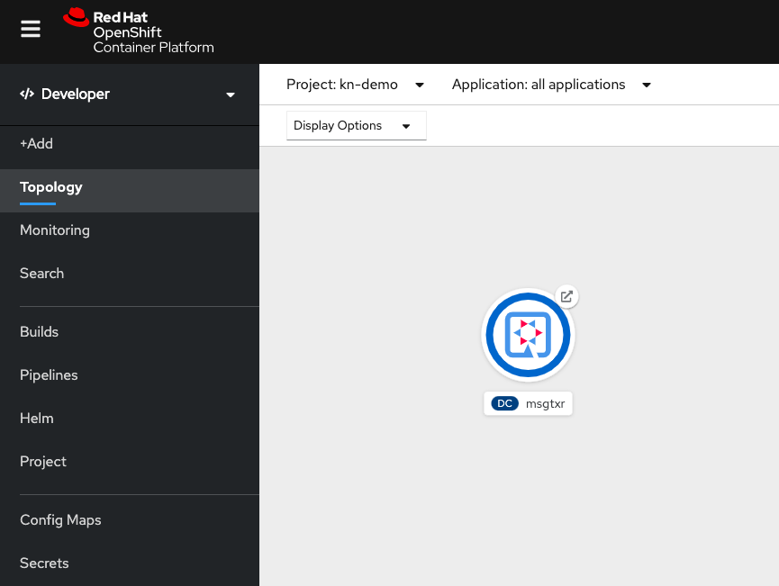

# Build using OpenShift Pipeline


## Pre-requisites
* OCP4 cluster with Knative-serving, Tekton installed
* You need to be logged in as admin credentials
* `git clone` this repository. We have some samples here.

## Steps

* Login as an `admin` user to your cluster

* Create a new project for your application

```
oc new-project kn-demo
```
>> **Note:** A project with name `kn-demo` was added to SMMR earlier. It makes this project part of ServiceMesh automatically.  

* Create a service account for your pipeline

```
oc create serviceaccount pipeline
oc adm policy add-scc-to-user privileged -z pipeline
oc adm policy add-role-to-user edit -z pipeline
```

We will use Openshift S2I to run the build.

Let us install tekton tasks for `s2i-go` and  `openshift-client`.

* `s2i-go` task is used to build an application written in golang
* `openshift-client` allows us to run `oc` commands as part of the pipeline

**Note:** List of S2I build tasks available for different languages can be found here:
[https://github.com/openshift/pipelines-catalog](https://github.com/openshift/pipelines-catalog)

```
oc create -f https://raw.githubusercontent.com/openshift/pipelines-catalog/master/s2i-go/s2i-go-task.yaml

oc create -f https://raw.githubusercontent.com/tektoncd/catalog/master/openshift-client/openshift-client-task.yaml

```

Download the project from https://github.com/RedHatWorkshops/knative-on-ocp4

```
git clone https://github.com/RedHatWorkshops/knative-on-ocp4.git
cd knative-on-ocp4
```

Now we will create the application objects `imagestream`, `deploymentconfig`, `service` and `route`. These objects are made available the pipeline folder.

```
$ oc create -f pipeline/openshift-objects.yaml
imagestream.image.openshift.io/dumpy created
deploymentconfig.apps.openshift.io/dumpy created
service/dumpy created
route.route.openshift.io/dumpy created
```


Let us look at the pipeline that shows the list of tasks within the pipeline to create the application image using `s2i-go` task and deploy it using `openshift-client` task. Note that this pipeline depends on source code coming from `app-git` and pushes image to `app-image` resource.

```
$ cat pipeline/pipeline.yaml
apiVersion: tekton.dev/v1alpha1
kind: Pipeline
metadata:
  name: deploy-pipeline
spec:
  resources:
  - name: app-git
    type: git
  - name: app-image
    type: image
  tasks:
  - name: build
    taskRef:
      name: s2i-go
    params:
      - name: TLSVERIFY
        value: "false"
    resources:
      inputs:
      - name: source
        resource: app-git
      outputs:
      - name: image
        resource: app-image
  - name: deploy
    taskRef:
      name: openshift-client
    runAfter:
      - build
    params:
    - name: ARGS
      value: 
           - rollout
           - latest
           - dumpy
```

Let us create the pipeline by running

```
$ oc create -f pipeline/pipeline.yaml

pipeline.tekton.dev/deploy-pipeline created
```


The resources used by this pipeline are defined in the `pipeline-resources` file as shown below:

```
$ cat pipeline/pipeline-resources.yaml
---
apiVersion: tekton.dev/v1alpha1
kind: PipelineResource
metadata:
  name: application-image
spec:
  type: image
  params:
  - name: url
    value: image-registry.openshift-image-registry.svc:5000/kn-demo/dumpy
---
apiVersion: tekton.dev/v1alpha1
kind: PipelineResource
metadata:
  name: sourcecode-git
spec:
  type: git
  params:
  - name: url
    value: https://github.com/redhatworkshops/openshift-knative-application

```

Now let us add these pipeline-resources running:

```
$ oc create -f pipeline/pipeline-resources.yaml

pipelineresource.tekton.dev/application-image created
pipelineresource.tekton.dev/sourcecode-git created
```

Let us use `tkn` to verify all the objects we just created as shown below:

```
$ tkn tasks list
NAME               AGE
openshift-client   11 seconds ago
s2i-go             3 hours ago

$ tkn pipeline list
NAME              AGE           LAST RUN   STARTED   DURATION   STATUS
deploy-pipeline   2 hours ago   ---        ---       ---        ---

$ tkn resource list
NAME                TYPE    DETAILS
application-image   image   url: image-registry.openshift-image-registry.svc:5000/kn-demo/dumpy
sourcecode-git      git     url: https://github.com/redhatworkshops/openshift-knative-application

```

Now let us run the pipeline using `tkn`. In the future you will also be able to start pipeline from devconsole.
* `-s` option is to pass the Service Account used to run this pipeline.
* `-r` option is used to pass the values for resources. Our pipeline above uses 2 resources and their values are already defined in the pipeline resources. So we are just passing those pipeline resources inputs while running the pipeline

`tkn pipeline start` will create a new `pipelinerun` object to start the pipeline.

```
$ tkn pipeline start deploy-pipeline -s pipeline -r app-git=sourcecode-git -r app-image=application-image

Pipelinerun started: deploy-pipeline-run-zlzqc
```
Note the name of the `pipelinerun` created above. We will use this to track the pipeline logs next. Run the following command to watch the logs.

```
$ tkn pipelinerun logs -f deploy-pipeline-run-zlzqc
```

This will output the logs as below:

```
[build : build-step-git-source-sourcecode-git-7bz5r] {"level":"warn","ts":1564597690.2913275,"logger":"fallback-logger","caller":"logging/config.go:65","msg":"Fetch GitHub commit ID from kodata failed: \"KO_DATA_PATH\" does not exist or is empty"}
[build : build-step-git-source-sourcecode-git-7bz5r] {"level":"info","ts":1564597690.74784,"logger":"fallback-logger","caller":"git/git.go:102","msg":"Successfully cloned https://github.com/redhatworkshops/openshift-knative-application @ master in path /workspace/source"}

[build : build-step-generate] Application dockerfile generated in /gen-source/Dockerfile.gen

[build : build-step-image-digest-exporter-generate-g6ltl] []

[build : build-step-build] STEP 1: FROM registry.access.redhat.com/devtools/go-toolset-rhel7
[build : build-step-build] Getting image source signatures
[build : build-step-build] Copying blob sha256:a4d9907173f48ee257a0d6c451d530a2ec4088c38908b2ec48e3bc8dc66c6d21


...
...

[build : build-step-push] Successfully pushed //image-registry.openshift-image-registry.svc:5000/kn-demo/dumpy:latest@sha256:f4ed6d33a45f937c9d85eecef5a7ff201d1a09a08d04511794de6dbe28f29eb3

[build : build-step-image-digest-exporter-push-7289l] []

[build : nop] Build successful

[deploy : build-step-oc] deploymentconfig.apps.openshift.io/dumpy rolled out

[deploy : nop] Build successful

```

You can also observe the running pipeline on devconsole. Navigate to your project `kn-demo` -> `Pipelines` from menu ->  select the pipelinerun that is currently in progress

Notes: you will need developer console to do the following steps.

You will see a screen like this:


You will observe that the deployment is also successful. You can look at the topology view of the running app.



Currently OpenShift Service Mesh sets up network policies that only allow ingress and egress connections from the service mesh. Since we added this project as a member under `ServiceMeshMemberRoll` we have to apply the following network policy for openshift route to work for this application.

```
apiVersion: networking.k8s.io/v1
kind: NetworkPolicy
metadata:
  name: dumpy 
  namespace: kn-demo 
  labels:
    app: dumpy 
spec:
  podSelector:
    matchLabels:
      app: dumpy 
  ingress:
  - {}
```

Apply the policy by running the following command:

```
oc apply -f  https://raw.githubusercontent.com/RedHatWorkshops/knative-on-ocp4/master/network-policies/dumpy-network-policy.yaml
```

Click on the link url on the right to corner of the dumpy icon or  run `oc get route` to find your application route to bring the running application up in the browser.

You will see output like this :

```
GET / HTTP/1.1
Host: dumpy-kn-demo.apps.first.40.ocpcloud.com
Accept: text/html,application/xhtml+xml,application/xml;q=0.9,image/webp,image/apng,*/*;q=0.8,application/signed-exchange;v=b3
Accept-Encoding: gzip, deflate
Accept-Language: en-US,en;q=0.9,te-IN;q=0.8,te;q=0.7
Forwarded: for=66.187.232.65;host=dumpy-kn-demo.apps.first.40.ocpcloud.com;proto=http;proto-version=
Upgrade-Insecure-Requests: 1
User-Agent: Mozilla/5.0 (Macintosh; Intel Mac OS X 10_14_5) AppleWebKit/537.36 (KHTML, like Gecko) Chrome/75.0.3770.142 Safari/537.36
X-Forwarded-For: 66.187.232.65
X-Forwarded-Host: dumpy-kn-demo.apps.first.40.ocpcloud.com
X-Forwarded-Port: 80
X-Forwarded-Proto: http

```

Add `/health` extension to the url, and you will see the following output indicating that your application is healthy.

```

                    888 888             888
                    888 888             888
                    888 888             888
888d888 .d88b.  .d88888 88888b.  8888b. 888888
888P"  d8P  Y8bd88" 888 888 "88b    "88b888
888    88888888888  888 888  888.d888888888
888    Y8b.    Y88b 888 888  888888  888Y88b.
888     "Y8888  "Y88888 888  888"Y888888 "Y888
```

Congratulations!! You have successfully build and deployed application on OCP4 using openshift pipelines.

##  Closing

We are going to deploy this application with knative-serving in the next lab. Let us idle this application for now.

**Note: ** Scale to zero was in OpenShift for years now. This idea just got to knative-serving.. wink, wink!!

```
$ oc idle dumpy
WARNING: idling when network policies are in place may cause connections to bypass network policy entirely
The service "kn-demo/dumpy" has been marked as idled
The service will unidle DeploymentConfig "kn-demo/dumpy" to 1 replicas once it receives traffic
DeploymentConfig "kn-demo/dumpy" has been idled
```

Note that the app shows without a blue circle on the screen showing that the pod is not running. But if you try to access it, it will scale up.


