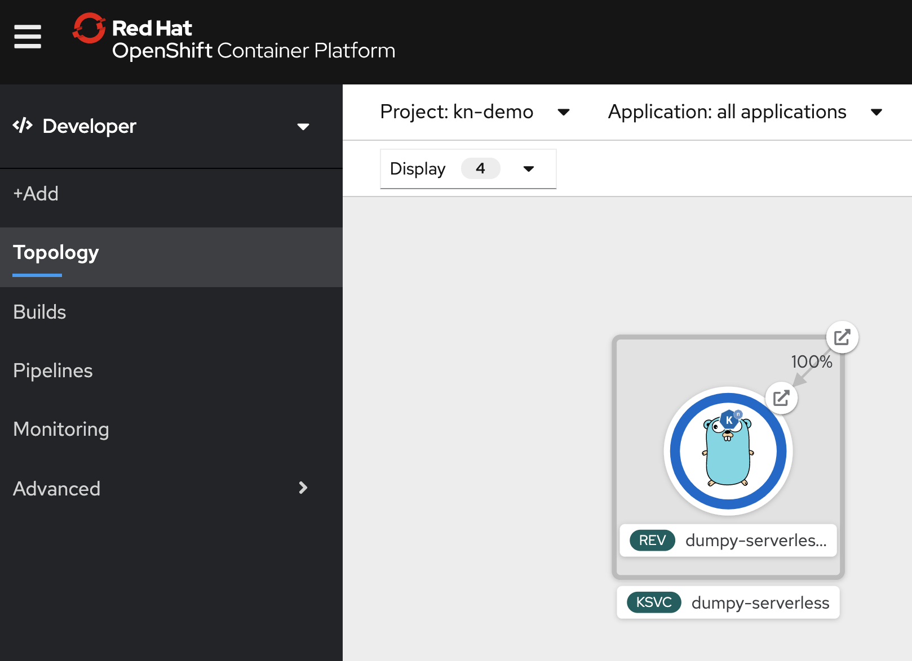
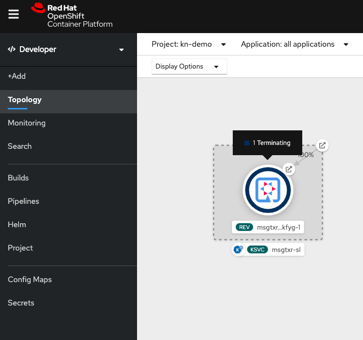

# Deploy Serverless App using Knative Serving

## Prerequisites
* Application was built earlier
* `kn` CLI installed 

## Install the Application

* Get the image repository name by running `oc get is`. This image was created using the openshift build in the last lab.

```
$ oc get is -n kn-demo
NAME    IMAGE REPOSITORY                                                 TAGS     UPDATED
dumpy   image-registry.openshift-image-registry.svc:5000/kn-demo/dumpy   latest   28 minutes ago

```
Copy the name of the `image repository` from above.


Create a knative service by running 

```
kn service create dumpy-serverless --image=image-registry.openshift-image-registry.svc:5000/kn-demo/dumpy
```

This command runs synchronously. It takes about a minute for the app to be deployed as a knative application.

``` 
Service 'dumpy-serverless' successfully created in namespace 'kn-demo'.
Waiting for service 'dumpy-serverless' to become ready ... OK

Service URL:
http://dumpy-serverless.kn-demo.apps.first.40.ocpcloud.com
```

Note that the output also displays the service URL.

Access the URL in the browser and watch the running application. This is the same application as in the last lab. But it now works with Knative Serving.



If you wait for a minute without using the application and you will observe that the application automagically scales down to 0.



Yeay!! We have now deployed and tested our application using Knative-serving.

But wait what does this `kn create service` create. Let us explore now.

## Explore the Knative Serving Objects


