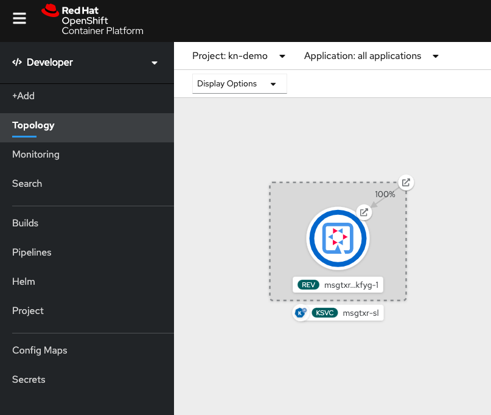

# Deploy Serverless App using Knative Serving

## Prerequisites
* Application was built earlier
* `kn` CLI installed

## Install the Application

* Get the image repository name by running `oc get is`. This image was created using the openshift build in the last lab.

```
$ oc get is -n kn-demo
NAME    IMAGE REPOSITORY                                                 TAGS     UPDATED
dumpy   image-registry.openshift-image-registry.svc:5000/kn-demo/dumpy   latest   28 minutes ago

```
Copy the name of the `image repository` from above.


Create a knative service by running

```
kn service create dumpy-serverless --image=image-registry.openshift-image-registry.svc:5000/kn-demo/dumpy -l app.kubernetes.io/name=golang
```

This command runs synchronously. It takes about a minute for the app to be deployed as a knative application.

```
Service 'dumpy-serverless' successfully created in namespace 'kn-demo'.
Waiting for service 'dumpy-serverless' to become ready ... OK

Service URL:
http://dumpy-serverless.kn-demo.apps.first.40.ocpcloud.com
```

Note that the output also displays the service URL.
Notes: If you get a slow system, you may get the following message:

```
timeout: service 'dumpy-serverless' not ready after 60 seconds
```
It is okay to get timeout. The service will come up

Access the URL in the browser and watch the running application. This is the same application as in the last lab. But it now works with Knative Serving.



If you wait for a minute without using the application and you will observe that the application automagically scales down to 0.


Yeay!! We have now deployed and tested our application using Knative-serving.

But wait what does this `kn create service` create. Let us explore now.

## Explore the Knative Serving Objects

List all Knative services:

```
$ kn service list
NAME               URL                                                           LATEST                     AGE   CONDITIONS   READY   REASON
dumpy-serverless   http://dumpy-serverless.kn-demo.apps.ocp4.home.ocpcloud.com   dumpy-serverless-bxbsp-1   13m   3 OK / 3     True    
```

List all Knative revisions:

```
$ kn revision list
NAME                     SERVICE            AGE    CONDITIONS   READY   REASON
dumpy-serverless-8q5dk   dumpy-serverless   17m    3 OK / 4     True    
dumpy-serverless-8rgxt   dumpy-serverless   23m    3 OK / 4     True    
dumpy-serverless-mf5cq   dumpy-serverless   46m    3 OK / 4     True    
dumpy-serverless-njdkn   dumpy-serverless   94m    3 OK / 4     True    
dumpy-serverless-qxltl   dumpy-serverless   24m    3 OK / 4     True    
dumpy-serverless-rn9px   dumpy-serverless   12m    3 OK / 4     True    
dumpy-serverless-zr59r   dumpy-serverless   144m   3 OK / 4     True    
```

List all Knative routes:
```
$ kn route list
NAME               URL                                                           READY
dumpy-serverless   http://dumpy-serverless.kn-demo.apps.ocp4.home.ocpcloud.com   True
```

Describe a Knative service:

```
$ kn service describe dumpy-serverless
Name:       dumpy-serverless
Namespace:  kn-demo
Labels:     app.kubernetes.io/name=golang
Age:        12m
URL:        http://dumpy-serverless.kn-demo.apps.ocp4.home.ocpcloud.com

Revisions:  
  100%  @latest (dumpy-serverless-bxbsp-1) [1] (12m)
        Image:  image-registry.openshift-image-registry.svc:5000/kn-demo/dumpy (pinned to c4011f)

Conditions:  
  OK TYPE                   AGE REASON
  ++ Ready                   9m 
  ++ ConfigurationsReady    12m 
  ++ RoutesReady             9m 
```
