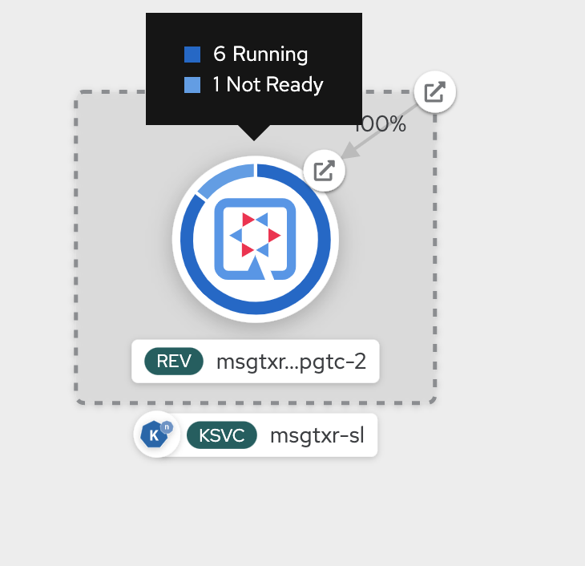
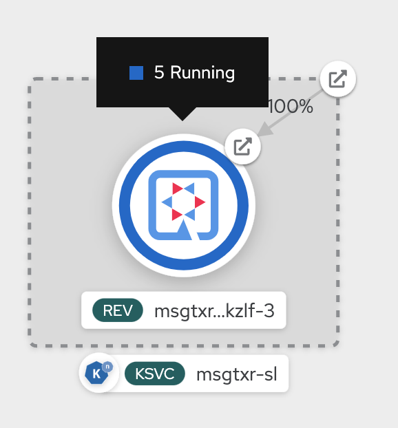

# Autoscaling Serverless Application with Knative serving

## Prerequisites
* This lab uses `siege` command. So install that if you don't already have it. Run `$ siege -v` to check if it is already on your workstation.

## Create a knative service

Create a knative service as explained in the previous chapter. If you have cleaned it up, create it again.

`kn service create msgtxr-sl --image=image-registry.openshift-image-registry.svc:5000/kn-demo/msgtxr -l app.openshift.io/runtime=quarkus`

## Update the Service to provide upper limit for scaling

Let us update our knative service to configure `concurrency-target` value that for when to scale up based on the concurrent number of incoming request. This is required to auto-scale the application.

```
$ kn service update msgtxr-sl --concurrency-target=5
Service 'dumpy-serverless' updated in namespace 'kn-demo'.
```

If you describe the service now, you will observe an annotation added to the service template ` autoscaling.knative.dev/target: "5"`.

```
$ kn service describe msgtxr-sl -o yaml
apiVersion: serving.knative.dev/v1
kind: Service
metadata:
  annotations:
    serving.knative.dev/creator: veer
    serving.knative.dev/lastModifier: veer
  creationTimestamp: "2020-05-14T02:52:03Z"
  generation: 2
  labels:
    app.openshift.io/runtime: quarkus
  name: msgtxr-sl
  namespace: kn-demo
  resourceVersion: "334296605"
  selfLink: /apis/serving.knative.dev/v1/namespaces/kn-demo/services/msgtxr-sl
  uid: cc517e12-7ec9-43b1-a2c5-f3d7c950e7e7
spec:
  template:
    metadata:
      annotations:
        autoscaling.knative.dev/target: "5"
        client.knative.dev/user-image: image-registry.openshift-image-registry.svc:5000/kn-demo/msgtxr
      creationTimestamp: null
      labels:
        app.openshift.io/runtime: quarkus
      name: msgtxr-sl-xpgtc-2
    spec:
      containerConcurrency: 0
      containers:
      - image: image-registry.openshift-image-registry.svc:5000/kn-demo/msgtxr@sha256:476b5558516f70af94e42e61b73fee3c67cb6ee4e498c63f1ea29b88592d62bc
        name: user-container
        readinessProbe:
          successThreshold: 1
          tcpSocket:
            port: 0
        resources:
          limits:
            cpu: "1"
            memory: 200M
          requests:
            cpu: 400m
            memory: 100M
      timeoutSeconds: 300
  traffic:
  - latestRevision: true
    percent: 100
status:
...
...
...
```

The above command creates a new revision for the service. You can check there are two revisions now:

```
$ kn revision list

NAME                SERVICE     TRAFFIC   TAGS   GENERATION   AGE     CONDITIONS   READY   REASON
msgtxr-sl-xpgtc-2   msgtxr-sl   100%             2            5m17s   3 OK / 4     True    
msgtxr-sl-xpzwg-1   msgtxr-sl                    1            5m27s   3 OK / 4     True
```

And it shows 100% traffic routing to the latest revision. If you check the routes, it has only one route like before.

```
$ kn route list
NAME        URL                                                    READY
msgtxr-sl   http://msgtxr-sl-kn-demo.YOURDOMAIN   True
```


## Load the application

Get the URL for your Knative Route.

```
export URL=$(kn route list  | awk  'NR>1 {print $2}')
```

Confirm that your application is scaled down to zero and you have no pods running. The command below should give you no results. If not wait a minute until your pods are scaled down to zero.

```
$ oc get po | grep Running
```

Let us load this application now by running siege. Have another window ready to watch the pods with `watch oc get po`

```
siege -r 1 -c 50 -t 30S $URL
```

You will quickly see on developer console that it spins up a bunch of pods.



and in a couple of minutes all these pods will autoscale down as the siege ends and the workload goes down.

But there were just too many pods coming up at the same time. Should we limit the number of pods that can come up. Let us update the service again to update the `max-scale`, upper limit for the number of pods to `5`

```
$ kn service update msgtxr-sl --max-scale=5
Updating Service 'msgtxr-sl' in namespace 'kn-demo':

  5.227s Traffic is not yet migrated to the latest revision.
  5.352s Ingress has not yet been reconciled.
  5.689s Ready to serve.

Service 'msgtxr-sl' updated to latest revision 'msgtxr-sl-mkzlf-3' is available at URL:
http://msgtxr-sl-kn-demo.YOURDOMAIN
```
Wit until the application scales down to 0. Now, try running `siege` again and this time it will only scale to `5` instances maximum



## Conclusion
  
In this lab we have learnt to set up our Knative Service for autoscaling.

# Cleanup

```
$ kn service delete msgtxr-sl
Service 'msgtxr-sl' successfully deleted in namespace 'kn-demo'.
```
