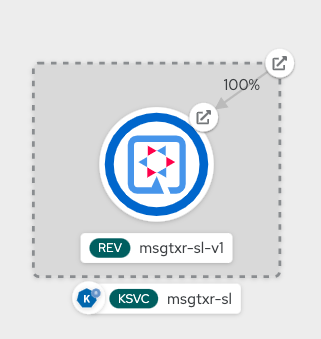
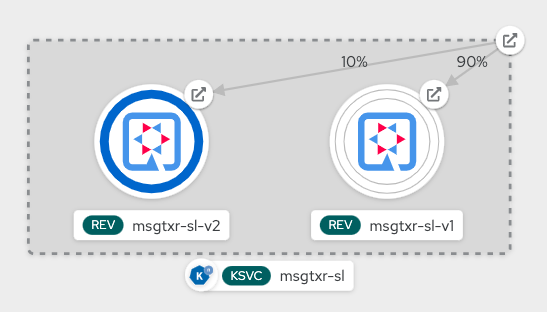
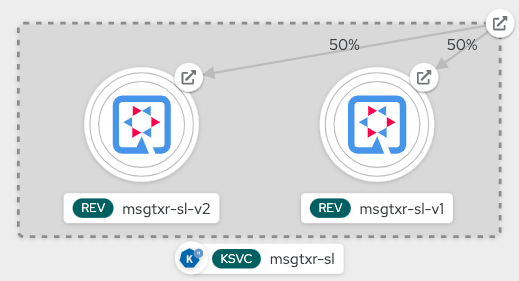

# Traffic Splitting with Knative serving
In this chapter we will learn traffic splitting with Knative Serving

## Prerequisites
* Application Image was built earlier
* `kn` CLI installed

## Deploy Knative Service

### Revision 1
Let us deploy application version 1 using the container image we created earlier. Note the parameters 
* `revision-name` to name the revision as `v1` which will suffixed to the service name
* environment variable `format` configure this app to `capitalize` the messages
* environment variable `message` is the message that is output by default
  
```
kn service create msgtxr-sl \
--image=image-registry.openshift-image-registry.svc:5000/kn-demo/msgtxr \
--revision-name=v1 \
-l app.openshift.io/runtime=quarkus \
--env format=capitalize \
--env message="version1 will capitalize the message"
```
Output
```
Creating service 'msgtxr-sl' in namespace 'kn-demo':

  0.260s The Route is still working to reflect the latest desired specification.
  0.498s Configuration "msgtxr-sl" is waiting for a Revision to become ready.
  4.601s ...
  4.740s Ingress has not yet been reconciled.
  5.176s Ready to serve.

Service 'msgtxr-sl' created to latest revision 'msgtxr-sl-hgdyx-1' is available at URL:
http://msgtxr-sl-kn-demo.YOURDOMAIN
```
Get revision list and notice the revision name and how `v1` is suffixed. 
```
% kn revision list
NAME           SERVICE     TRAFFIC   TAGS   GENERATION   AGE   CONDITIONS   READY   REASON
msgtxr-sl-v1   msgtxr-sl   100%             1            13s   4 OK / 4     True
```

You can also notice the knative service in developer console where 100% of traffic is going to revision `v1`


Get URL for the application

```
export URL=$(kn route list  | awk  'NR>1 {print $2}')
```
Verify by calling this URL

```
% curl $URL
MESSAGE CAPITALIZED : "VERSION1 WILL CAPITALIZE THE MESSAGE"
```
### Revision 2

Let us now update the service to create a new revision and introduce as a Canary that takes 10% traffic. Notice the parameters
* `revision-name` that will suffix `v2`
* environment variable `format` that configures the application to display `wordcount`
* `traffic` that shows the split of traffic between revisions `v1` and `v2`

```
kn service update msgtxr-sl \
--revision-name=v2 \
--env format=wordcount \
--env message="version2 displays word count for this message" \
--traffic msgtxr-sl-v1=90,msgtxr-sl-v2=10
```

Output
```
Updating Service 'msgtxr-sl' in namespace 'kn-demo':

  0.406s The Route is still working to reflect the latest desired specification.
  0.543s Revision "msgtxr-sl-v2" is not yet ready.
  5.041s ...
  5.130s Ingress has not yet been reconciled.
  5.231s Ready to serve.

Service 'msgtxr-sl' updated to latest revision 'msgtxr-sl-v2' is available at URL:
http://msgtxr-sl-kn-demo.YOURDOMAIN
```

Check revision list again. The output shows how traffic is split between the two revisions.

```
% kn revision list

NAME           SERVICE     TRAFFIC   TAGS   GENERATION   AGE     CONDITIONS   READY   REASON
msgtxr-sl-v2   msgtxr-sl   10%              2            47s     4 OK / 4     True    
msgtxr-sl-v1   msgtxr-sl   90%              1            5m10s   3 OK / 4     True 
```

You can notice the change in the developer console to see the traffic split as request between revisions `v1` and `v2`



Now let us test by curling the service a few times:

```
% for i in {1..20}; do curl -w "\n" $URL; done
MESSAGE CAPITALIZED : "VERSION1 WILL CAPITALIZE THE MESSAGE"
MESSAGE CAPITALIZED : "VERSION1 WILL CAPITALIZE THE MESSAGE"
MESSAGE CAPITALIZED : "VERSION1 WILL CAPITALIZE THE MESSAGE"
MESSAGE CAPITALIZED : "VERSION1 WILL CAPITALIZE THE MESSAGE"
MESSAGE CAPITALIZED : "VERSION1 WILL CAPITALIZE THE MESSAGE"
MESSAGE CAPITALIZED : "VERSION1 WILL CAPITALIZE THE MESSAGE"
MESSAGE CAPITALIZED : "VERSION1 WILL CAPITALIZE THE MESSAGE"
MESSAGE CAPITALIZED : "VERSION1 WILL CAPITALIZE THE MESSAGE"
MESSAGE CAPITALIZED : "VERSION1 WILL CAPITALIZE THE MESSAGE"
MESSAGE CAPITALIZED : "VERSION1 WILL CAPITALIZE THE MESSAGE"
MESSAGE CAPITALIZED : "VERSION1 WILL CAPITALIZE THE MESSAGE"
MESSAGE WORD COUNT: 7 SENTENCE: "version2 displays word count for this message"
MESSAGE CAPITALIZED : "VERSION1 WILL CAPITALIZE THE MESSAGE"
MESSAGE CAPITALIZED : "VERSION1 WILL CAPITALIZE THE MESSAGE"
MESSAGE CAPITALIZED : "VERSION1 WILL CAPITALIZE THE MESSAGE"
MESSAGE WORD COUNT: 7 SENTENCE: "version2 displays word count for this message"
MESSAGE CAPITALIZED : "VERSION1 WILL CAPITALIZE THE MESSAGE"
MESSAGE CAPITALIZED : "VERSION1 WILL CAPITALIZE THE MESSAGE"
MESSAGE CAPITALIZED : "VERSION1 WILL CAPITALIZE THE MESSAGE"
MESSAGE CAPITALIZED : "VERSION1 WILL CAPITALIZE THE MESSAGE"
```

## Update the traffic split for AB testing

Now let us update the traffic percentage to 50-50

```
kn service update msgtxr-sl \
--traffic msgtxr-sl-v1=50,msgtxr-sl-v2=50
```

Verify the percentages have taken effect
```
% kn revision list


NAME           SERVICE     TRAFFIC   TAGS   GENERATION   AGE     CONDITIONS   READY   REASON
msgtxr-sl-v2   msgtxr-sl   50%              2            7m44s   3 OK / 4     True    
msgtxr-sl-v1   msgtxr-sl   50%              1            12m     3 OK / 4     True
```


Test again with `for i in {1..10}; do curl -w "\n" $URL; done` and notice the output. 

**Note** that the traffic split will stabilize after pods for both the revisions are up. If the pods are scaled down, the results may not be consistent. 

```
% for i in {1..10}; do curl -w "\n" $URL; done
MESSAGE WORD COUNT: 7 SENTENCE: "version2 displays word count for this message"
MESSAGE CAPITALIZED : "VERSION1 WILL CAPITALIZE THE MESSAGE"
MESSAGE CAPITALIZED : "VERSION1 WILL CAPITALIZE THE MESSAGE"
MESSAGE WORD COUNT: 7 SENTENCE: "version2 displays word count for this message"
MESSAGE WORD COUNT: 7 SENTENCE: "version2 displays word count for this message"
MESSAGE WORD COUNT: 7 SENTENCE: "version2 displays word count for this message"
MESSAGE WORD COUNT: 7 SENTENCE: "version2 displays word count for this message"
MESSAGE CAPITALIZED : "VERSION1 WILL CAPITALIZE THE MESSAGE"
MESSAGE CAPITALIZED : "VERSION1 WILL CAPITALIZE THE MESSAGE"
MESSAGE CAPITALIZED : "VERSION1 WILL CAPITALIZE THE MESSAGE"
```

## Conclusion
We have tested traffic splitting with canary an change the percentage of traffic split. 

## Cleanup

```
$ kn service delete msgtxr-sl
Service 'msgtxr-sl' successfully deleted in namespace 'kn-demo'.
```


