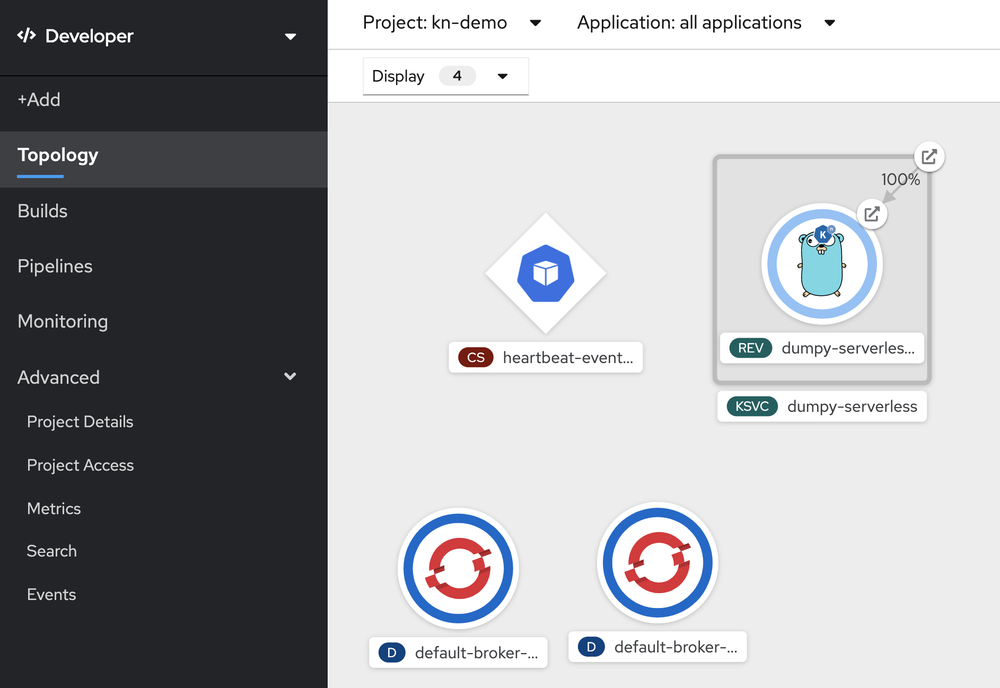

# Using Brokers and Triggers

Event Sources are the components that receive the external events and forward them onto Sinks which can be mediated by a Trigger. Triggers offer an opportunity to filter out events by attributes. Triggers are used to connect Knative Serving application to a Broker so that it can respond to the events that the Broker emits.


## Create an Event Source

This time we will create a ContainerSource that uses a heartbeat container. This is a heartbeat which generates events at a configurable rate, to be forwarded to the given sink. That sink is a broker that will be created shortly. 

```
apiVersion: sources.eventing.knative.dev/v1alpha1
kind: ContainerSource
metadata:
  name: heartbeat-event-source
spec:
  image: quay.io/openshift-knative/knative-eventing-sources-heartbeats:v0.7.1
  args:
   - '--label="<3"'
   - '--period=20'
  sink:
    apiVersion: eventing.knative.dev/v1alpha1
    kind: Broker
    name: default
```

* The above source will generate an event once every 20s.

Let us create the event source

```
$ oc create -f eventing/event-source-heartbeat.yaml
containersource.sources.eventing.knative.dev/heartbeat-event-source created
```

Verify

```
$ oc get containersources
NAME                     AGE
heartbeat-event-source   49s
```

## Add a Broker 

In order to create broker, we will have to label the namespace for `knative-eventing-injection=enabled` and it will automatically add broker with the name `default`.

```
$ oc label namespace kn-demo knative-eventing-injection=enabled
namespace/kn-demo labeled
```

```
$ oc get po -w
NAME                                                READY   STATUS              RESTARTS   AGE
default-broker-filter-59b5bc56-fjq75                1/1     Running             0          4m5s
default-broker-ingress-74759d5995-76lj5             1/1     Running             0          4m5s
```


## Create a Trigger

Let us create a trigger that connects the source to our Knative service.

```
apiVersion: eventing.knative.dev/v1alpha1
kind: Trigger
metadata:
  name: dumpy-trigger
spec:
  filter:
    sourceAndType:
      type: dev.knative.eventing.samples.heartbeat
  subscriber:
    ref:
      apiVersion: serving.knative.dev/v1alpha1
      kind: Service
      name: dumpy-serverless
```


* The event type `dev.knative.eventing.samples.heartbeat` is the one used by the ContainerSource image we deployed earlier.
* Subscriber is our knative service

Let us create the trigger

```
$ oc create -f eventing/event-trigger.yaml 
trigger.eventing.knative.dev/dumpy-trigger created
```

Verify

```
$ oc get trigger
NAME            READY   REASON   BROKER    SUBSCRIBER_URI                                      AGE
dumpy-trigger   True             default   http://dumpy-serverless.kn-demo.svc.cluster.local   5m52s
```

## Observe the Events in Action

List the pods running now. You'll see an hearbeat event source pod that starts generating events and your Knative service acting as the destination via the broker.

```
$ oc get po | grep Running
default-broker-filter-59b5bc56-fjq75                 1/1     Running     0          11m
default-broker-ingress-74759d5995-76lj5              1/1     Running     0          11m
dumpy-serverless-956fn-deployment-65cb7f5d97-rtq2d   2/2     Running     0          72s
heartbeat-event-source-lfgv4-7b548d97fd-jfsqx        1/1     Running     0          8m5s
```


Look at your Knative service logs, and you will see the heartbeats received from the heartbeat event source once in `20s`.

```
$ oc logs -f dumpy-serverless-956fn-deployment-65cb7f5d97-ctktq -c user-container
2019/08/01 18:41:43 Openshift Http Request Dumper received a message: POST / HTTP/1.1
Host: dumpy-serverless.kn-demo.svc.cluster.local
Accept-Encoding: gzip
Ce-Beats: true
Ce-Heart: "yes"
Ce-Id: d2563dff-bf5f-480f-bd6b-7f0ac4b048f4
Ce-Knativehistory: "default-kn-trigger-channel-ctp5x.kn-demo.svc.cluster.local"
Ce-Source: https://github.com/knative/eventing-contrib/cmd/heartbeats/#kn-demo/heartbeat-event-source-lfgv4-7b548d97fd-jfsqx
Ce-Specversion: 0.2
Ce-The: 42
Ce-Time: 2019-08-01T18:41:33.150791535Z
Ce-Type: dev.knative.eventing.samples.heartbeat
Content-Length: 26
Content-Type: application/json
Forwarded: for=10.131.2.22;proto=http, for=10.131.0.20
K-Proxy-Request: activator
User-Agent: Go-http-client/1.1
X-B3-Parentspanid: 312369ea7a8cb741
X-B3-Sampled: 0
X-B3-Spanid: 24a869bdf1ef398c
X-B3-Traceid: f3468ce3272a1aa58423b7e4879519a6
X-Envoy-Decorator-Operation: dumpy-serverless-956fn.kn-demo.svc.cluster.local:80/*
X-Envoy-Expected-Rq-Timeout-Ms: 600000
X-Envoy-Internal: true
X-Forwarded-For: 10.131.2.22, 10.131.0.20, 10.128.2.22
X-Forwarded-Proto: http
X-Request-Id: f90a94cb-863b-4f6a-8f38-70be720d7a57

{"id":3,"label":"\u003c3"}

```

Let us edit the event source to increase the time to 180s.

```
$ cat eventing/event-source-heartbeat-180s.yaml 
apiVersion: sources.eventing.knative.dev/v1alpha1
kind: ContainerSource
metadata:
  name: heartbeat-event-source
spec:
  image: quay.io/openshift-knative/knative-eventing-sources-heartbeats:v0.7.1 
  args:
   - '--label="<3"'
   - '--period=180'
  env:
    - name: POD_NAME
      valueFrom:
        fieldRef:
          fieldPath: metadata.name
    - name: POD_NAMESPACE
      valueFrom:
        fieldRef:
          fieldPath: metadata.namespace
  sink:
    apiVersion: eventing.knative.dev/v1alpha1
    kind: Broker
    name: default
```

Let us apply this change

```
$ oc replace -f eventing/event-source-heartbeat-180s.yaml 
containersource.sources.eventing.knative.dev/heartbeat-event-source replaced
```

Now observe your Knative destination service by running `watch oc get po ` or in the developer console.

You will notice that the the Knative application scales to zero after a minute and a new pod comes up every 120s due to heartbeat.



## Conclusion

In this lab we have learnt to configure a container based eventsource, a broker and a trigger that subscribes the event source to a destination.

## Cleanup

Delete Eventsource

```
$ oc delete -f eventing/event-source-heartbeat.yaml
containersource.sources.eventing.knative.dev "heartbeat-event-source" deleted
```

Delete  Trigger

```
$ oc delete -f eventing/event-trigger.yaml 
trigger.eventing.knative.dev "dumpy-trigger" deleted
```

Remove Broker

```
$ oc label namespace kn-demo knative-eventing-injection=disabled --overwrite=true
namespace/kn-demo labeled

$ oc delete brokers.eventing.knative.dev --all
broker.eventing.knative.dev "default" deleted

```

Now there should be no running pods

```
$ oc get po | grep Running
```


